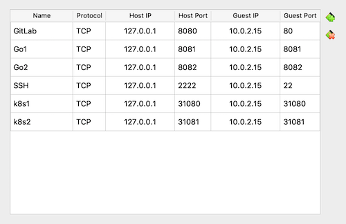

# SRE Assignment

All technical procedures of the assingment is documented.

Through out this document you may find links to external websites and articles which I used to troubleshoot and solve my technical challenges.

All related files for this assignment are available in my public GitHub repository:

[Elhamnf/go-web-hello-world](https://github.com/Elhamnf/go-web-hello-world)


## Task 0: Install Ubuntu 16.04 server 64bit

Installing VirtualBox 
Installing Ubuntu on virtualbox

Here is all the NAT configuration in the VirtualBox:




- **Challenges:**
  
  The problem : SSH connectiom could not be established with 
  ```
  ssh: connect to host 127.0.0.1 port 2222: Connection refused
  ```

- **Solution:**

  Based on these articles: 
  - [How to ssh from a host to a guest vm on your local machine](https://medium.com/nycdev/how-to-ssh-from-a-host-to-a-guest-vm-on-your-local-machine-6cb4c91acc2e)
  - [SSH connection refused](https://likegeeks.com/ssh-connection-refused/)

  I had to install SSH deamon. To install SSH deamon run the following command:

  ```sh
  $ sudo apt-get install openssh-server
  $ sudo service ssh status
  ```

## Task 1: Update system

 To update Linux kernel run the following command:

1. Update all repositories of the system.
    ```sh
    sudo apt update
    ```

2. Then upgrade all packages installed with the command below.

    ```sh
    sudo apt upgrade -y
    ```
3. Finally, reboot the server to ensure that potentially installed kernel updates get applied.
    ```sh
    sudo reboot
    ```
4. Now check again for upgradable packages with the command below.
    ```sh
    sudo apt list --upgradeable
    ```

## Task 2: Install gitlab-ce version in the host

1. Install and configure the necessary dependencies
    ```sh
    sudo apt-get install -y curl openssh-server ca-certificates tzdata
    ```

2. Add the GitLab package repository and install the package
    ```sh
    curl -sS https://packages.gitlab.com/install/repositories/gitlab/gitlab-ce/script.deb.sh | sudo bash
    ```
3. Setup GitLab instance to run at 127.0.0.1. Change `http://127.0.0.1` to the URL at which you want to access your GitLab instance
    ```sh
    sudo EXTERNAL_URL="http://127.0.0.1" apt-get install gitlab-ce
    ```

> **NOTE:** Make sure port forwarding is set properly for 80 -> 8080 in VirtualBox networking settings

4. Access GitLab from host machine at the following address `http://127.0.0.1:8080` and follow the instructions 
   On your first visit, you'll be redirected to a password reset screen. Provide the password for the initial administrator account and you will be redirected back to the login screen. Use the default account's username root to login.


## Task 3: Create a demo group/project in gitlab

1. Access GitLab from host machine http://127.0.0.1:8080

2. First create a group and name it `demo`

3. Inside the demo group, create a new project and name it `go-web-hello-world` 
   

### Install golang
1. Downloads the latest goland tarball:
    ```sh
    wget https://golang.org/dl/go1.15.linux-amd64.tar.gz
    ```
    > **wget** command is a command line utility for downloading files from the Internet.
2. Extract it into /usr/local, creating a Go tree in /usr/local/go:
    ```sh
    tar -C /usr/local -xzf go1.15.linux-amd64.tar.gz
    ```
    > **tar** saves many files together into a single tape or disk archive, and can restore individual files from the archive.
3. Add /usr/local/go/bin to the PATH environment variable. You can do this by adding this line to your /etc/profile:
    ```sh
    export PATH=$PATH:/usr/local/go/bin
    ```
    > What is **PATH** environment variable? 
    One of the most well-known is called PATH on Windows, Linux and Mac OS X. It specifies the directories in which executable programs* are located on the machine that can be started without knowing and typing the whole path to the file on the command line.

4. Reboot the system to export the new `PATH`
    ```
    sudo reboot
    ```

5. Wait for reboot to finish and then ssh back into the guest machine. 
    ```
    ssh elham@127.0.0.1 -p 2222
    ```
6. Test if go is accessible
    ```sh
    $ go version
    go version go1.15 linux/amd64
    ```
If you see the above output the go is installed successfully.

### Develope hello world web server app in golang

1. Clone the demo/go-web-hello-world project in your home directory in your guest machine

    ```sh
    git clone http://127.0.0.1/demo/go-web-hello-world.git
    ```
2. Copy paste the following code into: `~/go-web-hello-world/web-hello-world.go`

    ```go
    package main

    import (
        "fmt"
        "net/http"
    )

    func main() {
        http.HandleFunc("/", func(w http.ResponseWriter, r *http.Request) {
            fmt.Fprintf(w, "Go Web Hello World!\n")
        })

        http.ListenAndServe(":8081", nil)
    }ß

    ```
    The handler function receives two parameters:
    ```
    http.HandleFunc("/", func (w http.ResponseWriter, r *http.Request) {
        fmt.Fprintf(w, "Hello, you've requested: %s\n", r.URL.Path)
    })
    ```
    **An http.ResponseWriter** which is where you write your text/html response to.
    **An http.Request** which contains all information about this HTTP request including things like the URL or header fields.

    **Listen for HTTP Connections**
    The request handler alone can not accept any HTTP connections from the outside. An HTTP server has to listen on a port to pass connections on to the request handler. Because port 80 is in most cases the default port for HTTP traffic, this server will also listen on it.

    The following code will start HTTP server and listen for connections on port 8081. 
    ```go
    http.ListenAndServe(":8081", nil)
    ```
3. Build and run this project by the following command:
    ```sh
    $ go run web-hello-world.go
    ```
4. Test the web app on host machine:
   > **NOTE:** Make sure port forwarding is set properly for 8081 -> 8081 in VirtualBox networking settings
   ```sh
   $ curl http://127.0.0.1:8081
   ```
   if your app run successfully, expected to get this output:
    `Go Web Hello World!`

5. Push the code to GitLab:

    step1: ```$ git status```

    step2: ```$ git add web-hello-world.go```

    step3: ```$ git commit -m "added a go web app"```

    step4: ```$ git push origin ```

## Task 5: Install docker
Before you install Docker Engine for the first time on a new host machine, you need to set up the Docker repository. Afterward, you can install and update Docker from the repository.

1. Set up the repository:
    Update the apt package index and install packages to allow apt to use a repository over HTTPS:
    ```sh
    $ sudo apt-get update
    $ sudo apt-get install \
        apt-transport-https \
        ca-certificates \
        curl \
        gnupg-agent \
        software-properties-common
    ```    
2. Add Docker’s official GPG key:
    ```
    $ curl -fsSL https://download.docker.com/linux/ubuntu/gpg | sudo apt-key add -
    ```
    Verify that you now have the key with the right fingerprint:
    ```
    $ sudo apt-key fingerprint 0EBFCD88
    ```
    Expected output:
    ```
    pub   4096R/0EBFCD88 2017-02-22
        Key fingerprint = 9DC8 5822 9FC7 DD38 854A  E2D8 8D81 803C 0EBF CD88
    uid                  Docker Release (CE deb) <docker@docker.com>
    sub   4096R/F273FCD8 2017-02-22
    ```

3. Use the following command to set up the stable repository:

    ```sh
    $ sudo add-apt-repository \
       "deb [arch=amd64] https://download.docker.com/linux/ubuntu \
       $(lsb_release -cs) \
       stable"
    ```

4. Install Docker Engine:
Update the apt package index, and install the latest version of Docker Engine and containerd:
    ```sh
    $ sudo apt-get update
    $ sudo apt-get install docker-ce docker-ce-cli containerd.io
    ```
5. Verify that Docker Engine is installed correctly by running the hello-world image:
    ```sh
    $ sudo docker run hello-world
    ```

## Task 6: Run the app in container
An example is provided in this article: "https://www.callicoder.com/docker-golang-image-container-example/"

1. Defining the Docker image using a Dockerfile:
    Make a `Dockerfile` in the root of the project and copy paste the following code inside it.
    ```sh
    # get latest golang base image 
    FROM golang:latest

    # Set the Current Working Directory inside the container
    WORKDIR /app

    # Copy the source from the current directory to the Working Directory inside the container
    COPY web-hello-world.go .

    EXPOSE 8082

    # Command to run the executable
    CMD ["go","run","web-hello-world.go"]
    ```
   
    > **EXPOSE** instruction informs Docker that the container listens on the specified network ports at runtime. You can specify whether the port listens on TCP or UDP, and the default is TCP if the protocol is not specified.

2. Build docker image:
   To build docker image run the following command in the root of the project:

   ```sh
    $ docker build -t go-web-hello-world . 
    ```
3. Run docker image:
    To run the docker image execute the following command:
    ```sh
    $ docker run -d -p 8082:8081 go-web-hello-world
    ```
    > **NOTE:** -p option maps TCP port 8081 in the container to port 8082 on the Docker host.

    > **NOTE:** Make sure port forwarding is set properly for 8082-> 8082 in VirtualBox networking settings

4. Test the docker container: 
    Run the following command in the host machine
   ```sh
    curl http://127.0.0.1:8082
    Go Web Hello World!
    ```
- **Challenges:**
  
  The problem : connectiom between host machine and docker container could not be established.

- **Solution:**
 I expected that the fix could be in the `-p` option and I tried different combinations.

    ```sh
    $ docker run -d -p 8082:8081 go-web-hello-world
    ```
5. Push the Dockerfile into GitLab:
 
    step1: ```$ git status```

    step2: ```$ git add Dockerfile```

    step3: ```$ git commit -m "added a docker file for web app"```

    step4: ```$ git push origin ```

## Task 7: Push image to Docker Hub

   For detailed information refer to [Docker Hub Quickstart](https://docs.docker.com/docker-hub/).
1. Sign up for Docker Hub
   Create an account. My Docker ID is `elhamnf`.
2. Create an image `repository` in the Docker Hub
    Name the repository: `go-web-hello-world`.
3. Perform login in the terminal
    Run the following command to login into Docker:
    ```
    docker login
    ```
    Follow the insturctions to enter username and password
    If login is successful, expected output is similar to:
    ```
    WARNING! Your password will be stored unencrypted in /home/elham/.docker/config.json.
    Configure a credential helper to remove this warning. See
    https://docs.docker.com/engine/reference/commandline/login/#credentials-store

    Login Succeeded
    ```
4. Push image into Docker Hub
    - Get the container ID of the previously generated image:
    ```
    $ docker images
    REPOSITORY                   TAG                 IMAGE ID            CREATED             SIZE
    go-web-hello-world           latest              360d321560a1        22 minutes ago      839MB
    golang                       latest              75605a415539        2 weeks ago         839MB
    hello-world                  latest              bf756fb1ae65        8 months ago        13.3kB
    ```
    In this example the container ID is: `360d321560a1`.
    - Rename the already build docker image to proper name with the docker Id and tag:
    ```
    $ docker tag 360d321560a1 elhamnf/go-web-hello-world:v0.1
    ```
    - Push into Docker Hub
    ```
    $ docker push elhamnf/go-web-hello-world
    ```

    The image is accessible through: https://hub.docker.com/r/elhamnf/go-web-hello-world/tags


## Task 9: Install a single node Kubernetes cluster using kubeadm

For detailed instructions refer to:
- [Create Cluser using Kubeadm](https://kubernetes.io/docs/setup/independent/create-cluster-kubeadm/)
- [How to install kubernetes kubeadm](https://www.mirantis.com/blog/how-install-kubernetes-kubeadm/)

### Prepare VM
1. Change to root:
    ```sh
    sudo su
    ```

2. Turn off swap::
    ```sh
    swapoff -a
    ```
    comment out the reference to swap in /etc/fstab.  Start by editing the file:
    ```sh
    vi /etc/fstab
    ```
    Then comment out the appropriate line related to swap.

3. Configure iptables to receive bridged network traffic. First edit the sysctl.conf file:
    ```sh
    vi /etc/ufw/sysctl.conf
    ```
    And add the following lines to the end:
    ```sh
    net/bridge/bridge-nf-call-ip6tables = 1
    net/bridge/bridge-nf-call-iptables = 1
    net/bridge/bridge-nf-call-arptables = 1
    ```

4. Reboot so the changes take effect.
    ```sh
    reboot
    ```

5. Install ebtables and ethtool:
    ```sh
    sudo su
    apt-get install ebtables ethtool
    ```

6. Reboot once more.
    ```sh
    reboot
    ```
### Install Kubeadm

1. Install kubeadm
    ```sh
    sudo apt-get update && sudo apt-get install -y apt-transport-https curl
    curl -s https://packages.cloud.google.com/apt/doc/apt-key.gpg | sudo apt-key add -
    cat <<EOF | sudo tee /etc/apt/sources.list.d/kubernetes.list
    deb https://apt.kubernetes.io/ kubernetes-xenial main
    EOF
    sudo apt-get update
    sudo apt-get install -y kubelet kubeadm kubectl
    sudo apt-mark hold kubelet kubeadm kubectl
    ```

### Create a cluster
1. Create actual cluster
    ```sh
    kubeadm init --pod-network-cidr=192.168.0.0/16
    ```
2. Wait until init finishes and open a new terminal and execute the following commands:
    ```sh
    mkdir -p $HOME/.kube
    sudo cp -i /etc/kubernetes/admin.conf $HOME/.kube/config
    sudo chown $(id -u):$(id -g) $HOME/.kube/config
    ```
3. Install the Calico network plugin:
    ```sh
    kubectl apply -f https://docs.projectcalico.org/v3.8/manifests/calico.yaml
    ```
4. Untaint the master so that it will be available for scheduling workloads:
    ```sh
    kubectl taint nodes --all node-role.kubernetes.io/master-
    ```

### Deploy web app
1. Navigate to root of the go-web-hello-world repository and create a pod using `mypod.yaml`:
    ```sh
    kubectl apply -f mypod.yaml
    ```
2. Check that pod is up and running:
    ```sh
    $ kubectl get pods
    NAME                                  READY   STATUS    RESTARTS   AGE
    go-web-hello-world-6c49d9f858-njzwv   1/1     Running   0          5s
    ```
3. Test the web app in host machine:
    ```sh
    $ curl 127.0.0.1:31080
    Go Web Hello World!
    ```
    > **NOTE:** Make sure port forwarding is set properly for 31080 -> 31080 in VirtualBox networking settings


## Resources

- [Markdown Cheat Sheet](https://github.com/adam-p/markdown-here/wiki/Markdown-Cheatsheet)

